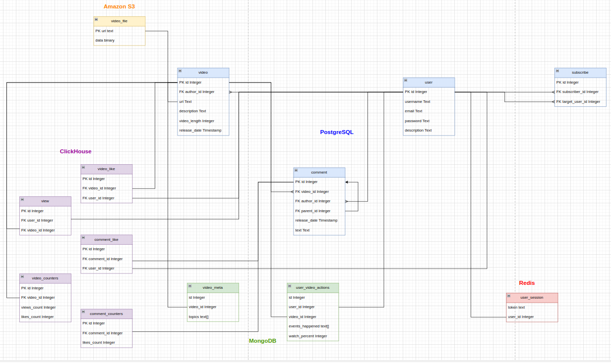

# Highload TikTok
## Содержание
#### [1. Тема и целевая аудитория](#1-тема-и-целевая-аудитория)
#### [2. Расчет нагрузки](#2-расчет-нагрузки)

## 1. Тема и целевая аудитория 

### Тема
TikTok - платформа для просмотра коротких видео. 

### Основной функционал сервиса
- Регистрация и авторизация
- Просмотр видео в ленте
    - Лента с рекомендованными видео    
    - Лента с видео авторов, на которых подписан пользователь
- Комментирование видео
- Лайки 
- Публикация видео
- Добавление в друзья
- Отправка/получение видео от друзей
- Подписки на других пользователей
- Поиск видео по ключевым словам (формирование ленты по результатам поиска)

### Основные продуктовые решения
- Ленты с видео формируются на основании предпочтений пользователя
- Ленты бесконечны, что должно сподвигнуть пользователя провести больше времени в приложении

### Целевая аудитория
- Весь мир.
- Пользователи:
    -  1.1 млрд. активыных пользователей в месяц \[[1](https://www.demandsage.com/tiktok-user-statistics/)]
    -  4.7 млрд. скачиваний \[[2]( https://www.omnicoreagency.com/tiktok-statistics/)]

- Распределение аудитории по странам \[[1](https://www.demandsage.com/tiktok-user-statistics/)]
  - Соединенные Штаты - 150 миллионов
  - Индонезия - 113 миллионов
  - Бразилия - 84.13 миллиона
  - Мексика - 62.44 миллиона
  - Россия - 51.24 миллиона
  - Вьетнам - 50.58 миллиона
  - Филиппины - 41.43 миллиона
  - Таиланд - 41.06 миллиона
  - Турция - 31.03 миллиона
  - Саудовская Аравия - 28.37 миллиона
  - Пакистан - 27.54 миллиона
  - Ирак - 25.51 миллиона
  - Египет - 25.5 миллиона

## 2. Расчет нагрузки   

### Данные из открытых источников
- MAU - 1.1 млрд. пользователей \[[1](https://www.demandsage.com/tiktok-user-statistics/)]
- DAU - 750 млн. пользователей \[[3](https://www.businessofapps.com/data/tik-tok-statistics/)]
- Среднее время пользования приложением за день 90 мин. \[[4](https://inclient.ru/tiktok-stats/)]
- Средний размер 15 сек. видео 4мб. \[[5](https://blog.talkhome.co.uk/technology/how-much-data-does-tiktok-use/)]
- В день пользователи выкладывают 34 млн. видео \[[6](https://www.usesignhouse.com/blog/tiktok-stats)]
- Максимальный размер видео 287.6 МБайт \[[6](https://wave.video/ru/blog/tiktok-video-size/)]
- С ноября 2021 по январь 2022 года в TikTok регистрировалось более 650 тысяч новых пользователей каждый день \[[4](https://inclient.ru/tiktok-stats/)]

### Данные, которые были взяты из предположения или примерные величины, полученные опытным путем
- Коэффициент соотношения пикового трафика к среднему k=1.65
- За 5 минут постоянно листая в среднем получается 150 МБ на все запросы для просмотра ленты
- Пользователь в среднем лайкает каждое 20ое видео (тк значительная часть пользователей не ставит лайки)
- Пользователь в среденем комментирует каждое 70ое видео (тк значительная часть пользователей не комментирует видео)

### Публикация видео
#### Продуктовые метрики
Средний месячный размер хранилища пользователя равен:
4 МБ * (34 млн видео / 750 млн пользователей) * 30 дней = 5.44 МБ.

Следовательно, средний размер хранилища пользователя(за 5 лет):
5.44 МБ * 12 месяцев * 5 лет = 326 МБ (0.31 ГБ)

Среднее количество действий пользователя в день:
34 млн видео / 750 млн пользователей = 0.05 видео

#### Технические метрики
Пользователь в среднем выкладывает 0.05 видео в день.
Таким образом, среднее количество запросов в секунду равно:
0.05 * 750000000 / (24 * 60 * 60) = 434 RPS

Размер хранения публикаций видео:
0.31 ГБ * 750000000 / 1024 = 227050 Тб

Максимальный размер видео в тикток может быть 287.6 МБайт. Пиковое потребление в течении суток. Трафик по часам распределяется равномерно, потому что пользователи из разных часовых поясов, поэтому средний трафик от пикового не отличается, поэтому возьмем небольшой коэфицент k=1.65, на который умножим этот средний трафик, и получим пиковый:
(287.6 * 8 / 1000 / 1000) Тбит * 34 млн/д / (24 * 60 * 60) * 1.65 = 1.4939 Тбит/с

Суммарный суточный трафик (объем данных, передающихся через сети за сутки):
34 млн/д * 4 МБ / 1024 = 132812 Гбайт/д

### Просмотр ленты

#### Продуктовые метрики
Средний размер хранилища пользователя: 
Незначительный: требуется хранить id пользователя и что он смотрел. Не будем учитывать.

Средний размер видео 15 секунд, следовательно, при том что среднее время в приложении в день 90 минут, пользователь в среднем смотрит:
60 / 15 * 90 = 360 действий/день

#### Технические метрики
Размер хранения не учитываем из-за незначительных данных.

Пользователь в среднем смотрит 360 видео в день, среднее количество запросов в секунду равно:
360 * 750000000 / (24 * 60 * 60) = 3125000 RPS

За  5 минут постоянно листая в среднем получается 150 МБ на все запросы для просмотра ленты.
Пиковое потребление в течении суток. Трафик по часам распределяется равномерно, потому что пользователи из разных часовых поясов, поэтому средний трафик от пикового не отличается, поэтому возьмем небольшой коэфицент k=1.65, на который умножим этот средний трафик, и получим пиковый:
((((150 МБ / (5 * 60) секунд) Мбайт/с * 8 / 1000 / 1000) Тбит/с * (90 * 60) c) Тбит * 750 млн/д) Тбит/д / (24 * 60 * 60) Тбит/с * 1.65 = 309.375 Тбит/с

Суммарный суточный трафик:
((150 МБ / (5 * 60)) МБ/с / 1024 Гб/c * (90 * 60 c/д)) Гб/д * 750млн = 1977539062 Гбайт/день

### Регистрация
С ноября 2021 по январь 2022 года в TikTok регистрировалось более 650 тысяч новых пользователей каждый день, следовательно:
650000 / 24 / 60 / 60 = 7.52 регистраций/секунду

### Авторизация 
Предположим, что авторизуются пользователи в 10 раз чаще, чем регистрируются, поэтому имеем: 
7.52 * 10 = 75.2 авторизаций/секунду

### Лайки/комментарии 
Мы ранее получили, что пользователь в среденем смотрит 360 видео в день. При том, что пользователь в среднем лайкает каждое 10 видео и комментирует каждое 50ое, получаем в среднем на пользователя:
360 / 20 = 18 лайков/день на пользователя
360 / 70 = 5.14 комментария/день на пользователя

Теперь посчитаем RPS и RPD для лайков и комментариев:
18 * 750000000 = 13 500 000 000 лайков/день
13 500 000 000 / 24 / 60 / 60 = 156250 лайков/секунду

5.14 * 750 000 000 = 3 855 000 000 комментариев/день
3 855 000 000 / 24 / 60 / 60 = 44618 комментариев/секунду

### Итоговые таблицы

#### Продуктовые метрики:
| Действие         | Средний размер хранилища пользователя (ГБайт) | Среднее количество действий пользователя в день |
|------------------|-----------------------------------------------|-------------------------------------------------| 
| Публикация видео | 0.31                                          | 0.05                                            |
| Просмотр ленты   | Незначителен                                  | 360                                             |

#### Технические метрики
| Действие         | Размер хранения (Тб) | Пиковое потребление в течении суток (Тбит/с) | Суммарный суточный трафик (Гбайт/д)  |
|------------------|----------------------|----------------------------------------------|-----------------------------|
| Публикация видео | 227050                 | 1.4939                                         | 132812 Гбайт/д           | 
| Просмотр ленты   | Незначителен         | 309.375                                          | 1977539062                 |

#### RPS 
| Действие         | RPS    |
|------------------|--------| 
| Публикация видео | 434    |
| Просмотр ленты   | 3125000 |
| Регистрация      | 7.5    |
| Авторизация      | 75.2   |
| Лайки            | 156250   |
| Комментарии      | 44618   |

## 3. Глобальная балансировка нагрузки

### Географическое расположение дата-центров

Исходя из данных, представленных в пункте "Распределение аудитории по странам", мы можем сделать вывод, что наиболее значительная часть аудитории TikTok находится в Северной и Южной Америке (США, Мексика, Бразилия) и в Индонезии.

Далее Европа, в которой аудитория распределена примерно равномерно. Особенность Азии в том, что TikTok в Индии заблокирован, а в Китае нет приложения TikTok, вместо него есть аналог Douyin, который под рассмотрение не попадает.

По этим причинам есть смысл расположить дата-центры в крупных городах США и так, чтобы они были в разных частях страны:
- Нью-Йорк
- Лос-Анджелес 
- Даллас 

Следующей по числу пользователей страной является Индонезия, поэтому там тоже нужно расположить несколько дата-центров по тому же принципу: 
- Джакарта 
- Медан

Далее расположим несколько дата-центров в Бразилии: 
- Бразилиа 
- Сан-Паул

Несмотря на близость Мексики к США, поставим там дата-центр, так как в Мексике находится довольно занчительное число пользователей:
- Мехико

В России также достаточно много пользователей, поэтом добавим дата-центр:
- Москва

Теперь распределим дата-центры по крупным городам Европы: 
- Лондон (покрывает большую часть Европы)
- Анкара (покрывает часть Европы и арабские страны)

Теперь распределим дата-центры по крупным городам Азии, удаленым друг от друга:
- Ханой
- Токио

Также добавим дата-центр, который будет покрывать немногочисленную аудиторию в Африке, нужно выбрать крупный город, примерно в центре Африки: 
- Лагос

### DNS
Для DNS балансировки будем использовать Latency-based DNS. Сервер выдает адрес ближайшего к пользователю ДЦ с минимальным RTT.

### BGP 
Будем использовать BGP Anycast, чтобы для нескольких дата-центров находящихся в одной стране можно было выдавать один ip адрес, а пользователь будет направялться на ближайший дата-центр

## Локальная балансировка нагрузки
В нашей схеме балансировки запросы будут приходить на L3 балансировщик, который будет быстро распределять запросы между L7 балансировщиками,
которые будут равномерно распределять запросы по конечным серверам.

### L3 балансировка
На сетевом уровне будем использовать Virtual Server via Direct Routing. Несмотря на то, что в этом случае требуется, чтобы сервера находились внутри одной физической сети, этот метод балансировки обеспечивает выскокую произоводительность.

Будем использовать keepalived программный монитор доступности нод. Он будет сигнализировать балансеру при падении/подъеме ноды.

### L7 балансировка
Nginx будет выступать в роли прокси-сервера и распределять запросы от клиентов между несколькими серверами-бэкендами для обеспечения равномерной нагрузки и улучшения производительности серверов.

## Логическая схема БД

## Физическая схема БД
#### PostgreSQL

#### MongoDB

#### Redis

### Основные решения
| Технология     |                                                                         Область применения                                                                          |
|:---------------|:-------------------------------------------------------------------------------------------------------------------------------------------------------------------:|
| Выбор СУБД     |    PostgeSQL – для основных продуктовых сущностей, MongoDB – для статистики и меты для подбора видео, Redis - для хранения сессий, Amazon S3 для хранения видео.    |
| Индексы        |                               user.username, comment.video_id, subscribe.target_user_id, video_like.video_id, comment_like.comment_id                               |
| Шардинг        |                                                                                по id                                                                                |
| Денормализация | Дублирование метаданных о видео в PostgreSQL и MongoDB, счетчики likes_count, на таблицах video и comment, хотя можно посчитать запросом по like, views_count также |

### Индексы

#### Хэш-индекс для поля username таблицы user
Данный индекс необходим для регистрации/авторизации, когда нужно проверить, есть ли такой username в БД.

#### Хэш-индекс для поля video_id таблицы comment
Данный индекс необходим для поиска комментариев по video_id, когда нужно быстро получить комментарии под видео.

#### Хэш-индекс для поля target_user_id таблицы subscribe
Данный индекс необходим для поиска подписчиков для target_user_id, когда нужно быстро получить подписчиков для пользователя.

#### Хэш-индекс для поля video_id таблицы video_like
Данный индекс необходим для поиска лайков для видео, когда нужно быстро получить количество лайков под видео.

#### Хэш-индекс для поля comment_id таблицы comment_like
Данный индекс необходим для поиска лайков для комментария, когда нужно быстро получить количество лайков под комментарием.

### Шардирование и резервирование СУБД. Схема резервного копирования.

Выберем ключ разбиения на шарды крупных таблиц. Таблицу view будем шардировать по video_id, video_like по video_id, comment_like по comment_id, 
comment по video_id, остальные таблицы по id.

В целях резервного копирования на каждом из дата-центров установим одну вторичную базу данных. В случае сбоя основной базы, эта вторичная база принимает на себя роль основной, управляя данными пользователей. Резервные данные регулярно экспортируются на внешний накопитель.

### Таблица `user`
| Название поля       | Тип данных | Размер (байты) |
|---------------------|------------|----------------|
| id                  | uuid       |       16       |
| username            | varchar    |       16       |
| email               | varchar    |       16       |
| password            | bytes      |       16       |
| description         | varchar    |       256      |
| **Итого за запись** |            |     **320**    |

### Таблица `video`
| Название поля       | Тип данных | Размер (байты) | 
|---------------------|------------|----------------|
| id                  | uuid       |       16       |
| author_id           | uuid    |       16       |
| video_path          | varchar    |       16       |
| description         | varchar    |       256      |
| likes_count         | uuid       |       16       |
| release_date        | uuid       |       8        |
| **Итого за запись** |            |     **328**    |

### Таблица `video_like`
| Название поля | Тип данных | Размер (байты) |
|---------------|------------|----------------|
| id            | uuid       | 16             |
| video_id      | uuid       | 16             |
| user_id       | uuid    | 16             |
| **Итого за запись** |            | **48**          |

### Таблица `comment_like`
| Название поля       | Тип данных | Размер (байты) |
|---------------------|------------|----------------|
| id                  | uuid       | 16             |
| comment_id          | uuid       | 16             |
| user_id             | uuid    | 16             |
| **Итого за запись** |            | **48**          |

### Таблица `comment`
| Название поля       | Тип данных | Размер (байты) |
|---------------------|------------|----------------|
| id                  | uuid       |       16       |
| video_id            | uuid       |       16       |
| author_id           | uuid    |       16       |
| text                | varchar    |       256      |
| likes_count         | uuid       |       16       |
| parent_id           | uuid       |       16       |
| release_date        | varchar    |       8        |
| **Итого за запись** |            |     **344**    |

### Таблица `subscribe`
| Название поля | Тип данных | Размер (байты) |
|----------|------------|----------------|
| id       |   uuid  |       16       |
| subscriber_id |   uuid  |       16       |
| target_user_id |   uuid  |       16       |
| **Итого за запись** |            |     **32**     |

### Таблица `view`
| Название поля       | Тип данных | Размер (байты) |
|---------------------|------------|----------------|
| id                  |   uuid  |       16       |
| user_id             |   uuid  |       16       |
| video_id            |   uuid  |       16       |
| **Итого за запись** |            |     **32**     |

### `user_session`
| Название поля       | Тип данных | Размер (байты) |
|---------------------|------------|----------------|
| user_id             | uuid       | 16             |
| token               | varchar    | 256            |
| **Итого за запись** |            | **272**        |

### `video_meta`
| Название поля       | Тип данных   | Размер (байты) |
|---------------------|--------------|----------------|
| id                  | uuid         | 16             |
| video_id            | uuid         | 16             |
| likes_count         | uuid         | 16             |
| views_count         | uuid         | 16             |
| video_length        | uuid         | 16             |
| topics              | video_topics | 22             |
| **Итого за запись** |              | **102**        |

### `user_video_actions`
| Название поля       | Тип данных | Размер (байты) |
|---------------------|------------|----------------|
| id                  | uuid       | 16             |
| user_id             | uuid       | 16             |
| video_id            | uuid       | 16             |
| liked               | bool       | 1              |
| commented           | bool       | 1              |
| finished_watching   | bool       | 1              |
| **Итого за запись** |            | **51**         |

### `video_topics`
| Название поля       | Тип данных | Размер (байты) |
|---------------------|------------|----------------|
| id                  | uuid       | 16             |
| dance               | uuid       | 1              |
| humor               | uuid       | 1              |
| fashion             | bool       | 1              |
| food                | bool       | 1              |
| challenges          | bool       | 1              |
| education           | bool       | 1              |
| **Итого за запись** |            | **22**         |

## Алгоритмы

### Формирование рекомендаций

Алгоритм формирования рекомендаций будет состоять из нескольких ключевых шагов:

1. Сбор данных
- Каждый раз, когда пользователь пролистывает пачку видео, отправляются на сервер их данные (user_video_actions): ``user_id``, ``video_id``, ``finished_watching``, ``liked``, ``commented``.
- Из таблицы с метаданными видео, полученными при обработке, берутся по ``video_id`` данные: ``likes_count``, ``views_count``, ``video_length``, ``topiks``.
2. Запись данных
- Сохранение данных: данные, полученные от клиента и метаданные каждого видео, записываются в MongoDB.
- Отправка данных на обработку: Отправка пачки вышеупомянутых данных пользователя брокеру сообщений для последующей обработки.
3. Анализ данных
- Генерация рекомендаций: Модель предсказывает, какие видео из вариантов, которые модели сохраняли при публикации видео и удаляли при удалении видео, могут заинтересовать пользователя, на основе его полученных взаимодействий.
- Сохранение данных: Полученные ``video_id`` отправляются в ленту пользоваетеля.
5. Постоянное обновление и оптимизация
- Постоянное обновление рекомендаций: Фоновое дополнение рекомендаций для каждого ``username`` из таблицы с аналитикой действий пользования ``user_video_actions``.

### Обработка загружаемых видео

1. Загрузка видео
- Получение файла: Пользователь загружает видео на платформу.
- Проверка формата: Алгоритм проверяет, соответствует ли загруженный файл поддерживаемым форматам (например, MP4).
2. Отправка видео на сервер
- Загрузка видео в облачное хранилище Amazon S3.
2. Предварительная обработка
- Преобразование видео в стандартный формат и разрешение для обеспечения совместимости и оптимизации производительности.
3. Анализ содержимого
- Детектирование вредоносного и запрещенного контента: Использование алгоритмов машинного обучения для обнаружения неподобающего или нежелательного контента (например, насилия, ненормативной лексики). В случае, если что-то обнаружено, отправка пользователю отказ в загрузке.
- Распознавание лиц и объектов: Анализ видео на предмет наличия лиц, объектов, которые могут быть важны для классификации и рекомендаций для полей video_topics: ``dance``, ``humor``, ``fashion``, ``food``, ``challenges``, ``education``.
4. Сохранение
- Сохранение видео: Загрузка видео в облачное хранилище Amazon S3.
- Сохранение в бд: в базе данных PostgreSQL в таблице ``videos`` с уникальным идентификатором. В базе данных MongoDB сохранение полученных метаданных в таблице ``video_meta``.

В качестве начальной рекомендации или при нехватке подготовленной информации будут возвращаться наиболее популярные видео, основанные на общем количестве просмотров (``views_count``) и количестве лайков (``likes_count``) во всей системе. Это обеспечит начальное вовлечение пользователя, пока не накопится достаточно данных для персонализации.

## Источники
1. https://www.demandsage.com/tiktok-user-statistics/
2. https://www.omnicoreagency.com/tiktok-statistics/
3. https://www.businessofapps.com/data/tik-tok-statistics/
4. https://inclient.ru/tiktok-stats/
5. https://blog.talkhome.co.uk/technology/how-much-data-does-tiktok-use/
6. https://www.usesignhouse.com/blog/tiktok-stats
7. https://wave.video/ru/blog/tiktok-video-size/
