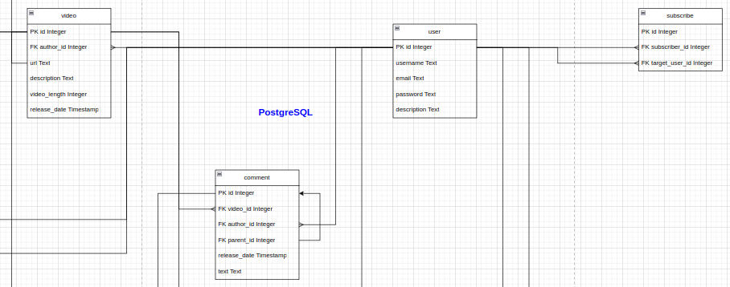
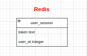
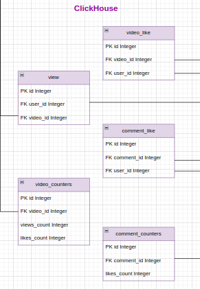
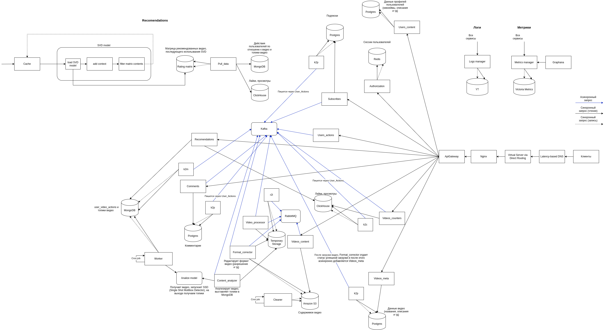

# Highload TikTok

## 1. Тема и целевая аудитория 

### Тема
TikTok - платформа для просмотра коротких видео. 

### Основной функционал сервиса
- Регистрация и авторизация
- Просмотр видео в ленте
    - Лента с рекомендованными видео    
    - Лента с видео авторов, на которых подписан пользователь
- Комментирование видео
- Лайки 
- Публикация видео
- Добавление в друзья
- Отправка/получение видео от друзей
- Подписки на других пользователей

### Основные продуктовые решения
- Ленты с видео формируются на основании предпочтений пользователя
- Ленты бесконечны, что должно сподвигнуть пользователя провести больше времени в приложении

### Целевая аудитория
- Весь мир.
- Пользователи:
    -  1.1 млрд. активыных пользователей в месяц \[[1](https://www.demandsage.com/tiktok-user-statistics/)]
    -  4.7 млрд. скачиваний \[[2]( https://www.omnicoreagency.com/tiktok-statistics/)]

- Распределение аудитории по странам \[[1](https://www.demandsage.com/tiktok-user-statistics/)]
  - Соединенные Штаты - 150 миллионов
  - Индонезия - 113 миллионов
  - Бразилия - 84.13 миллиона
  - Мексика - 62.44 миллиона
  - Россия - 51.24 миллиона
  - Вьетнам - 50.58 миллиона
  - Филиппины - 41.43 миллиона
  - Таиланд - 41.06 миллиона
  - Турция - 31.03 миллиона
  - Саудовская Аравия - 28.37 миллиона
  - Пакистан - 27.54 миллиона
  - Ирак - 25.51 миллиона
  - Египет - 25.5 миллиона

## 2. Расчет нагрузки   

### Данные из открытых источников
- MAU - 1.1 млрд. пользователей \[[1](https://www.demandsage.com/tiktok-user-statistics/)]
- DAU - 750 млн. пользователей \[[3](https://www.businessofapps.com/data/tik-tok-statistics/)]
- Среднее время пользования приложением за день 90 мин. \[[4](https://inclient.ru/tiktok-stats/)]
- Средний размер 15 сек. видео 4мб. \[[5](https://blog.talkhome.co.uk/technology/how-much-data-does-tiktok-use/)]
- В день пользователи выкладывают 34 млн. видео \[[6](https://www.usesignhouse.com/blog/tiktok-stats)]
- Максимальный размер видео 287.6 МБайт \[[6](https://wave.video/ru/blog/tiktok-video-size/)]
- С ноября 2021 по январь 2022 года в TikTok регистрировалось более 650 тысяч новых пользователей каждый день \[[4](https://inclient.ru/tiktok-stats/)]

### Данные, которые были взяты из предположения или примерные величины, полученные опытным путем
- Коэффициент соотношения пикового трафика к среднему k=1.65
- За 5 минут постоянно листая в среднем получается 150 МБ на все запросы для просмотра ленты
- Пользователь в среднем лайкает каждое 20ое видео (тк значительная часть пользователей не ставит лайки)
- Пользователь в среденем комментирует каждое 70ое видео (тк значительная часть пользователей не комментирует видео)

### Публикация видео
#### Продуктовые метрики
Средний месячный размер хранилища пользователя равен:
4 МБ * (34 млн видео / 750 млн пользователей) * 30 дней = 5.44 МБ.

Следовательно, средний размер хранилища пользователя(за 5 лет):
5.44 МБ * 12 месяцев * 5 лет = 326 МБ (0.31 ГБ)

Среднее количество действий пользователя в день:
34 млн видео / 750 млн пользователей = 0.05 видео

#### Технические метрики
Пользователь в среднем выкладывает 0.05 видео в день.
Таким образом, среднее количество запросов в секунду равно:
0.05 * 750000000 / (24 * 60 * 60) = 434 RPS

Размер хранения публикаций видео:
0.31 ГБ * 750000000 / 1024 = 227050 Тб

Максимальный размер видео в тикток может быть 287.6 МБайт. Пиковое потребление в течении суток. Трафик по часам распределяется равномерно, потому что пользователи из разных часовых поясов, поэтому средний трафик от пикового не отличается, поэтому возьмем небольшой коэфицент k=1.65, на который умножим этот средний трафик, и получим пиковый:
(287.6 * 8 / 1000 / 1000) Тбит * 34 млн/д / (24 * 60 * 60) * 1.65 = 1.4939 Тбит/с

Суммарный суточный трафик (объем данных, передающихся через сети за сутки):
34 млн/д * 4 МБ / 1024 = 132812 Гбайт/д

### Просмотр ленты

#### Продуктовые метрики
Средний размер хранилища пользователя: 
Незначительный: требуется хранить id пользователя и что он смотрел. Не будем учитывать.

Средний размер видео 15 секунд, следовательно, при том что среднее время в приложении в день 90 минут, пользователь в среднем смотрит:
60 / 15 * 90 = 360 действий/день

#### Технические метрики
Размер хранения не учитываем из-за незначительных данных.

Пользователь в среднем смотрит 360 видео в день, среднее количество запросов в секунду равно:
360 * 750000000 / (24 * 60 * 60) = 3125000 RPS

За  5 минут постоянно листая в среднем получается 150 МБ на все запросы для просмотра ленты.
Пиковое потребление в течении суток. Трафик по часам распределяется равномерно, потому что пользователи из разных часовых поясов, поэтому средний трафик от пикового не отличается, поэтому возьмем небольшой коэфицент k=1.65, на который умножим этот средний трафик, и получим пиковый:
((((150 МБ / (5 * 60) секунд) Мбайт/с * 8 / 1000 / 1000) Тбит/с * (90 * 60) c) Тбит * 750 млн/д) Тбит/д / (24 * 60 * 60) Тбит/с * 1.65 = 309.375 Тбит/с

Суммарный суточный трафик:
((150 МБ / (5 * 60)) МБ/с / 1024 Гб/c * (90 * 60 c/д)) Гб/д * 750млн = 1977539062 Гбайт/день

### Регистрация
С ноября 2021 по январь 2022 года в TikTok регистрировалось более 650 тысяч новых пользователей каждый день, следовательно:
650000 / 24 / 60 / 60 = 7.52 регистраций/секунду

### Авторизация 
Предположим, что авторизуются пользователи в 10 раз чаще, чем регистрируются, поэтому имеем: 
7.52 * 10 = 75.2 авторизаций/секунду

### Лайки/комментарии 
Мы ранее получили, что пользователь в среднем смотрит 360 видео в день. При том, что пользователь в среднем лайкает каждое 10 видео и комментирует каждое 50ое, получаем в среднем на пользователя:
360 / 20 = 18 лайков/день на пользователя
360 / 70 = 5.14 комментария/день на пользователя

Теперь посчитаем RPS и RPD для лайков и комментариев:
18 * 750000000 = 13 500 000 000 лайков/день
13 500 000 000 / 24 / 60 / 60 = 156250 лайков/секунду

5.14 * 750 000 000 = 3 855 000 000 комментариев/день
3 855 000 000 / 24 / 60 / 60 = 44618 комментариев/секунду

### Итоговые таблицы

#### Продуктовые метрики:
| Действие         | Средний размер хранилища пользователя (ГБайт) | Среднее количество действий пользователя в день |
|------------------|-----------------------------------------------|-------------------------------------------------| 
| Публикация видео | 0.31                                          | 0.05                                            |
| Просмотр ленты   | Незначителен                                  | 360                                             |

#### Технические метрики
| Действие         | Размер хранения (Тб) | Пиковое потребление в течении суток (Тбит/с) | Суммарный суточный трафик (Гбайт/д) |
|------------------|----------------------|----------------------------------------------|-------------------------------------|
| Публикация видео | 227050               | 1.4939                                       | 132812 Гбайт/д                      | 
| Просмотр ленты   | Незначителен         | 309.375                                      | 1977539062                          |

#### RPS
| Действие         | RPS     |
|------------------|---------| 
| Публикация видео | 434     |
| Просмотр ленты   | 3125000 |
| Регистрация      | 7.5     |
| Авторизация      | 75.2    |
| Лайки            | 156250  |
| Комментарии      | 44618   |

## 3. Глобальная балансировка нагрузки

### Географическое расположение дата-центров

Исходя из данных, представленных в пункте "Распределение аудитории по странам", мы можем сделать вывод, что наиболее значительная часть аудитории TikTok находится в Северной и Южной Америке (США, Мексика, Бразилия) и в Индонезии.

Далее Европа, в которой аудитория распределена примерно равномерно. Особенность Азии в том, что TikTok в Индии заблокирован, а в Китае нет приложения TikTok, вместо него есть аналог Douyin, который под рассмотрение не попадает.

По этим причинам есть смысл расположить дата-центры в крупных городах США и так, чтобы они были в разных частях страны:
- Нью-Йорк
- Лос-Анджелес 
- Даллас 

Следующей по числу пользователей страной является Индонезия, поэтому там тоже нужно расположить несколько дата-центров по тому же принципу: 
- Джакарта 
- Медан

Далее расположим несколько дата-центров в Бразилии: 
- Бразилиа 
- Сан-Паул

Несмотря на близость Мексики к США, поставим там дата-центр, так как в Мексике находится довольно занчительное число пользователей:
- Мехико

В России также достаточно много пользователей, поэтом добавим дата-центр:
- Москва

Теперь распределим дата-центры по крупным городам Европы: 
- Лондон (покрывает большую часть Европы)
- Анкара (покрывает часть Европы и арабские страны)

Теперь распределим дата-центры по крупным городам Азии, удаленым друг от друга:
- Ханой
- Токио

Также добавим дата-центр, который будет покрывать немногочисленную аудиторию в Африке, нужно выбрать крупный город, примерно в центре Африки: 
- Лагос

### DNS
Для DNS балансировки будем использовать Latency-based DNS. Сервер выдает адрес ближайшего к пользователю ДЦ с минимальным RTT.

### BGP 
Будем использовать BGP Anycast, чтобы для нескольких дата-центров находящихся в одной стране можно было выдавать один ip адрес, а пользователь будет направялться на ближайший дата-центр

## 4. Локальная балансировка нагрузки
В нашей схеме балансировки запросы будут приходить на L3 балансировщик, который будет быстро распределять запросы между L7 балансировщиками,
которые будут равномерно распределять запросы по конечным серверам.

### L3 балансировка
На сетевом уровне будем использовать Virtual Server via Direct Routing. Несмотря на то, что в этом случае требуется, чтобы сервера находились внутри одной физической сети, этот метод балансировки обеспечивает выскокую произоводительность.

Будем использовать keepalived программный монитор доступности нод. Он будет сигнализировать балансеру при падении/подъеме ноды.

### L7 балансировка
Nginx будет выступать в роли прокси-сервера и распределять запросы от клиентов между несколькими серверами-бэкендами для обеспечения равномерной нагрузки и улучшения производительности серверов.

## 5. Логическая схема БД

## 6. Физическая схема БД
#### PostgreSQL

#### MongoDB

#### Redis

#### Amazon S3

#### ClickHouse

### Основные решения
| Технология     |                                                                                             Область применения                                                                                              |
|:---------------|:-----------------------------------------------------------------------------------------------------------------------------------------------------------------------------------------------------------:|
| Выбор СУБД     | PostgeSQL – для основных продуктовых сущностей, MongoDB – для статистики и меты для подбора видео, Redis - для хранения сессий, ClickHouse для храниения просмотров и лайков, Amazon S3 для хранения видео. |
| Индексы        |                                           user.username, comment.video_id, subscribe.target_user_id, view.video_id, video_like.video_id, comment_like.comment_id                                            |
| Шардинг        |                                             view по video_id, video_like по video_id, comment_like по comment_id, comment по video_id, остальные таблицы по id                                              |
| Денормализация |                     Дублирование метаданных о видео в PostgreSQL и MongoDB, счетчики likes_count, на таблицах video и comment, хотя можно посчитать запросом по like, views_count также                     |

### Индексы

#### Хеш-индекс для поля username таблицы user
Данный индекс необходим для регистрации/авторизации, когда нужно проверить, есть ли такой username в БД.

#### Хеш-индекс для поля video_id таблицы comment
Данный индекс необходим для поиска комментариев по video_id, когда нужно быстро получить комментарии под видео.

#### Хеш-индекс для поля target_user_id таблицы subscribe
Данный индекс необходим для поиска подписчиков для target_user_id, когда нужно быстро получить подписчиков для пользователя.

#### Aggregating индекс для поля video_id таблицы view
Данный индекс необходим для поиска просмотров для видео, когда нужно быстро получить количество просмотров под видео.

#### Aggregating индекс для поля video_id таблицы video_like
Данный индекс необходим для поиска лайков для видео, когда нужно быстро получить количество лайков под видео.

#### Aggregating индекс для поля comment_id таблицы comment_like
Данный индекс необходим для поиска лайков для комментария, когда нужно быстро получить количество лайков под комментарием.

### Шардирование и резервирование СУБД. Схема резервного копирования.

Выберем ключ разбиения на шарды крупных таблиц. Таблицу view будем шардировать по video_id, video_like по video_id, comment_like по comment_id, 
comment по video_id, остальные таблицы по id.

В целях резервного копирования на каждом из дата-центров установим одну вторичную базу данных. В случае сбоя основной базы, эта вторичная база принимает на себя роль основной, управляя данными пользователей. Резервные данные регулярно экспортируются на внешний накопитель.

### Таблица `user`
| Название поля       | Тип данных | Размер (байты) |
|---------------------|------------|----------------|
| id                  | uuid       |       16       |
| username            | varchar    |       16       |
| email               | varchar    |       16       |
| password            | bytes      |       16       |
| description         | varchar    |       256      |
| **Итого за запись** |            |     **320**    |

### Таблица `video`
| Название поля       | Тип данных | Размер (байты) | 
|---------------------|------------|----------------|
| id                  | uuid       |       16       |
| author_id           | uuid    |       16       |
| url                 | varchar    |       16       |
| description         | varchar    |       256      |
| video_length         | uuid       |       16       |
| release_date        | uuid       |       8        |
| **Итого за запись** |            |     **328**    |

### Таблица `comment`
| Название поля       | Тип данных | Размер (байты) |
|---------------------|------------|----------------|
| id                  | uuid       | 16             |
| video_id            | uuid       | 16             |
| author_id           | uuid    | 16             |
| text                | varchar    | 256            |
| parent_id           | uuid       | 16             |
| release_date        | varchar    | 8              |
| **Итого за запись** |            | **328**        |

### Таблица `subscribe`
| Название поля | Тип данных | Размер (байты) |
|----------|------------|----------------|
| id       |   uuid  |       16       |
| subscriber_id |   uuid  |       16       |
| target_user_id |   uuid  |       16       |
| **Итого за запись** |            |     **32**     |

### `view`
| Название поля       | Тип данных | Размер (байты) |
|---------------------|------------|----------------|
| id                  |   uuid  | 16             |
| user_id             |   uuid  | 16             |
| video_id            |   uuid  | 16             |
| count               | uuid       | 16             |
| **Итого за запись** |            | **64**         |

### `video_like`
| Название поля       | Тип данных | Размер (байты) |
|---------------------|------------|----------------|
| id                  | uuid       | 16             |
| video_id            | uuid       | 16             |
| user_id             | uuid    | 16             |
| **Итого за запись** |            БД опять| **48**         |

### `video_counters`
| Название поля       | Тип данных | Размер (байты) |
|---------------------|------------|----------------|
| id                  | uuid       | 16             |
| video_id            | uuid       | 16             |
| views_count         | uuid    | 16             |
| likes_count         | uuid       | 16             |
| **Итого за запись** |            БД опять| **64**          |

### `comment_like`
| Название поля       | Тип данных | Размер (байты) |
|---------------------|------------|----------------|
| id                  | uuid       | 16             |
| comment_id          | uuid       | 16             |
| user_id             | uuid    | 16             |
| count               | uuid       | 16             |
| **Итого за запись** |            | **64**         |

### `comment_counters`
| Название поля       | Тип данных | Размер (байты) |
|---------------------|------------|----------------|
| id                  | uuid       | 16             |
| comment_id          | uuid       | 16             |
| likes_count         | uuid       | 16             |
| **Итого за запись** |            БД опять| **48**         |

### `user_session`
| Название поля       | Тип данных | Размер (байты) |
|---------------------|------------|----------------|
| user_id             | uuid       | 16             |
| token               | varchar    | 256            |
| **Итого за запись** |            | **272**        |

### `video_meta`
| Название поля       | Тип данных | Размер (байты) |
|---------------------|------------|----------------|
| id                  | uuid       | 16             |
| video_id            | uuid       | 16             |
| topics              | text[]     | -              |
| **Итого за запись** |            | **от 32**      |

### `user_video_actions`
| Название поля       | Тип данных | Размер (байты) |
|---------------------|------------|----------------|
| id                  | uuid       | 16             |
| user_id             | uuid       | 16             |
| video_id            | uuid       | 16             |
| watch_percent       | uuid       | 16             |
| events_happened     | text[]     | -              |
| **Итого за запись** |            | **от 64**      |

## 7. Алгоритмы

### Формирование рекомендаций

Алгоритм формирования рекомендаций будет состоять из нескольких ключевых шагов:

1. Сбор данных
- Каждый раз, когда пользователь пролистывает пачку видео, отправляются на сервер их данные (user_video_actions): ``user_id``, ``video_id``, ``watch_percent``, ``events_happened``.
- Из таблицы с метаданными видео, полученными при обработке, берутся по ``video_id`` данные ``topiсs``.
2. Запись данных
- Отправка данных на обработку: сервис рекоммендаций кладет пачку вышеупомянутых данных брокеру сообщений (Kafka)
- Сохранение данных: в зависимости от EventType (из events_happened) происходит обновление данных в бд.
3. Анализ данных (модель - SVD (Singular Value Decomposition))
- Генерация рекомендаций: Модель предсказывает, какие видео из вариантов, которые модели сохраняли при публикации видео, могут заинтересовать пользователя, на основе его полученных взаимодействий.
- Сохранение данных: Полученные ``video_id`` отправляются в ленту пользоваетеля.
4. Постоянное обновление и оптимизация
- Постоянное обновление рекомендаций: Фоновое дополнение рекомендаций для каждого ``user_id`` из таблицы с аналитикой действий пользования ``user_video_actions``.

### Обработка загружаемых видео

1. Загрузка видео
- Получение файла: Пользователь загружает видео на платформу.
- Проверка формата: Алгоритм проверяет, соответствует ли загруженный файл поддерживаемым форматам (например, MP4).
2. Предварительная обработка
- Преобразование видео в стандартный формат и разрешение для обеспечения совместимости и оптимизации производительности 
(MP4, кодек H.264, разрешение 1080x1920, 30 fps, битрейт 4 Mbps)
3. Анализ содержимого (модель - SSD (Single Shot Multibox Detector))
- Детектирование вредоносного и запрещенного контента: Использование алгоритмов машинного обучения для обнаружения неподобающего или нежелательного контента (например, насилия, ненормативной лексики). В случае, если что-то обнаружено, отправка пользователю отказ в загрузке.
- Распознавание лиц и объектов: Анализ видео на предмет наличия лиц, объектов, которые могут быть важны для классификации и рекомендаций для topics.
4. Сохранение
- Сохранение видео: Загрузка видео в облачное хранилище Amazon S3.
- Сохранение в бд: в базе данных PostgreSQL в таблице ``video`` с уникальным идентификатором. В базе данных MongoDB сохранение полученных метаданных в таблице ``video_meta``.

В качестве начальной рекомендации или при нехватке подготовленной информации будут возвращаться наиболее популярные видео, основанные на общем количестве просмотров (``views_count``) и количестве лайков (``likes_count``). Это обеспечит начальное вовлечение пользователя, пока не накопится достаточно данных для персонализации.

## 8. Технологии

|     Технология     |                                     Область применения                                      |                                                 Мотивационная часть                                                 |
|:------------------:|:-------------------------------------------------------------------------------------------:|:-------------------------------------------------------------------------------------------------------------------:|
|       Golang       |                            Язык программирования серверной части                            | Удобство разработки, производительность, система асинхронности, автоматическая сборка мусора, технологии из коробки |
|       Python       |                                             ML                                              |                     Язык программирования для выполнения задач связанных с машиннным обучением                      |
|       React        |                                        Фронтенд-веб                                         |                                            Компонентный подход к верстке                                            |
|       Kotlin       |                                      Фронтенд-андроид                                       |                                 Современный язык для разработки Android-приложений                                  |
|       Swift        |                                        Фронтенд-ios                                         |                                   Современный язык для разработки iOS-приложений                                    |
| Prometheus+Grafana |                     Система сбора и отображения статистики по запросам                      |                                      Удобная система для мониторинга запросов                                       |
|     Kubernetes     |                                           Деплой                                            |                              Масштабирование, отказоустойчивость, утилизация ресурсов                               |
|       GitLab       |                    Система контроля версий, командная разработка, CI/CD                     |                                   Распространенная система контроля для компаний                                    |
|       Redis        |                                Кэш (авторизационные токены)                                 |                              Хранение данных в оперативной памяти для быстрого доступа                              |
|     Amazon S3      |                           Хранение статического контента (видео)                            |                         Стандартный протокол облачного хранения, в нем будем хранить видео                          |
|     PostgreSQL     |                                  Хранение основных данных                                   |                                            Современная реляционная СУБД                                             |
|     ClickHouse     | Хранение данных, которые надо часто и в больших количествах агрегировать (просмотры, лайки) |                                                Быстрая колоночная БД                                                |
|      MongoDB       |             Хранение аналитических данных (мета видео, действия пользователей)              |                            Гибкая NoSQL база данных для хранения и обработки документов                             |
|       Kafka        |                                      Брокер сообщений                                       |                                         Подходит для больших потоков данных                                         |
|       Nginx        |                                       L7 балансировка                                       |                                    Простая настройка, высокая производительность                                    |

## 9. Схема проекта

## 10. Обеспечение надежности

### Мониторинг
Сбор метрик, отображаемых в Grafana, и отправка алертов, помогают своевремнно выявить проблемные места в коде, 
например долгое выполнение определенных запросов поможет заострить внимание на анализе пути запроса и ускорении запроса.
Грамотное логгирование.

### QA
CI/CD, качественное тестирование, code review.

### Резервирование ресурсов 
Резервируем сервера, датацентры, CPU, диски, память 

### Резервирование баз данных и брокера сообщений
В Postgres, MongoDB, Redis используем механизм репликации master-slave, а также периодическое резервное копирование данных.
В ClickHouse используем репликацию с помощью ReplicatedMergeTree.

У Kafka будем использовать соглашение exactly once. Это значит, что если приложение-продюсер из-за сбоя сети или какой-то внутренней ошибки 
повторно отправит одни и те же данные в Kafka, сообщение будет записано в топик только один раз.

### Graceful shutdown 
Необходимо реализовать “плавную” остановку (сервер не получает новые запросы, ожидает закрытия всех
активных соединений, чтобы завершить свою работу).

### Graceful degradation
Необходима проработка архитектуры, которая учитывает отказ компонентов и продолжает
стабильно работать некоторое или неограниченное количество времени. Функции с наибольшим трафиком находятся в приоритете, скорее всего
при отказе компонентов не получится поддержать функциональность на 100%.

Для TikTok критичной функциональностью будет авторизация, загрузка видео, просмотр ленты.

Примеры:
- Если упал сервис рекомендаций, идем в сервис Videos_meta и ранжируем видео только по данным из ClickHouse
(просмотры, лайки).
- Если упал ClickHouse, не отображаем просмотры, лайки.

### Failover policy 
- перезапросы 
- меньше запросов, которые посылаются на проблемный хост, компонент
- Circuit Breaker. Реализуем с помощью Nginx. Лимитируем трафик к сервисам, на основании отслеживаемого количества возвращаемых ошибок. 

## 11. Расчет ресурсов

| Действие                | Сервисы                                      | RPS     | Требуемое количество ядер | Требуемое количество RAM |
|-------------------------|----------------------------------------------|---------|---------------------------|--------------------------| 
| Публикация видео        | Videos_content, Videos_meta                  | 434     | 5                         | 1 Гб                     |
| Просмотр ленты          | Recommendations, Videos_content, Videos_meta | 3125000 | 31250                     | 3125 Гб                  |
| Авторизация/регистрация | Authorization, Users_content                 | 85      | 9                         | 1 Гб                     |
| Лайки                   | Videos_meta, Users_actions                   | 156250  | 1562                      | 160 Гб                   | 
| Комментарии             | Comments, Users_actions                      | 44618   | 446                       | 45 Гб                    |

| Сервер            | Хостинг | Процессор                     | Ядра | Оперативная память | Долговременная память        | Приблизительная стоимость за единицу | Амортизация на 5 лет | Цена аренды | Сетевая карта | Количество  | 
|-------------------|---------|-------------------------------|------|--------------------|------------------------------|--------------------------------------|----------------------|-------------|---------------|-------------|
| PostgreSQL        | own     | 2 x Intel Xeon Gold 6248R     | 28   | 384 ГБ DDR4 ECC    | 4 x 1 ТБ NVMe SSD в RAID 10  | $15,000                              | 250 $/мес.           | 550 $/мес.  | 10 GbE        | 400         |
| MongoDB           | own     | 2 x AMD EPYC 7742             | 64   | 1 ТБ DDR4 ECC      | 8 x 2 ТБ NVMe SSD в RAID 10  | $20,000                              | 330 $/мес.           | 650 $/мес.  | 25 GbE        | 500         |
| ClickHouse        | own     | 2 x Intel Xeon Platinum 8280  | 28   | 768 ГБ DDR4 ECC    | 8 x 4 ТБ NVMe SSD в RAID 10  | $20,000                              | 330 $/мес.           | 650 $/мес.  | 25 GbE        | 500         |
| Redis             | own     | 2 x Intel Xeon Gold 6248R     | 28   | 256 ГБ DDR4 ECC    | 2 x 1 ТБ NVMe SSD в RAID 1   | $10,000                              | 170 $/мес.           | 350 $/мес.  | 10 GbE        | 100         |
| kubenode          | own     | 2 x AMD EPYC 7742             | 64   | 1 ТБ DDR4 ECC      | 4 x 1 ТБ NVMe SSD в RAID 10  | $20,000                              | 330 $/мес.           | 650 $/мес.  | 25 GbE        | 600         |

Учитывая амортизацию на 5 лет, выгоднее покупать собственные сервера

Суммарные затраты на сервера с собственным хостингом = 250 * 400 + 330 * 500 + 330 * 500 + 170 * 100 + 330 * 600 = 645000 $/мес.

В случае с Amazon S3, плата взимается за Гб, которые мы храним. При стандартном тарифе плата будет составлять примерно 23 $/Тб. Это около 100000 $/мес. суммарно.

## Источники
1. https://www.demandsage.com/tiktok-user-statistics/
2. https://www.omnicoreagency.com/tiktok-statistics/
3. https://www.businessofapps.com/data/tik-tok-statistics/
4. https://inclient.ru/tiktok-stats/
5. https://blog.talkhome.co.uk/technology/how-much-data-does-tiktok-use/
6. https://www.usesignhouse.com/blog/tiktok-stats
7. https://wave.video/ru/blog/tiktok-video-size/
